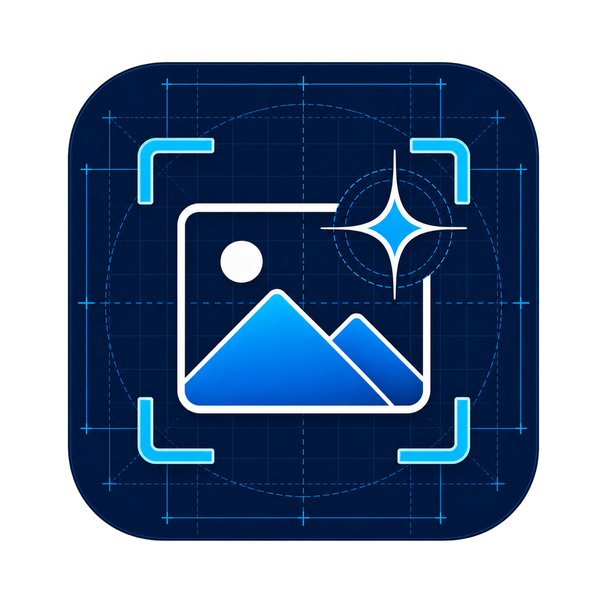

# Image Pro

<p align="center">
  
</p>

แอปแต่งภาพแบบ offline สำหรับ macOS ที่เน้น workflow สั้น: ลากรูปเข้า เลือกงาน ดูตัวอย่าง แล้วค่อย export ไฟล์เต็มความละเอียด

## สถานะโครงการ

- Phase ปัจจุบัน: usable offline build ครบ workflow หลัก Phase 1–5 และรอบ stability/UX
- Platform เป้าหมาย: Apple Silicon, macOS 14+
- Network policy: ประมวลผลรูปภายในเครื่องทั้งหมด; network ใช้เฉพาะการเช็ก GitHub Release ที่ปิดได้
- Version: 0.2.0
- วันที่ปรับปรุงล่าสุด: 2026-07-16

## เอกสารหลัก

| เอกสาร | ใช้สำหรับ |
|---|---|
| [Product plan](docs/PRODUCT_PLAN.md) | ขอบเขตผลิตภัณฑ์และพฤติกรรมของฟีเจอร์ |
| [Technical research](docs/TECH_RESEARCH.md) | งานวิจัยและการเลือกเทคโนโลยี/โมเดล |
| [OCR research](docs/OCR_RESEARCH.md) | เปรียบเทียบ OCR หลายภาษา/ลายมือและเกณฑ์เพิ่ม provider |
| [Architecture](docs/ARCHITECTURE.md) | โครงสร้างระบบและ contract ระหว่างโมดูล |
| [UI specification](docs/UI_SPEC.md) | หน้าจอ interaction และ visual direction |
| [Roadmap](docs/ROADMAP.md) | milestone และ exit criteria |
| [Backlog](docs/BACKLOG.md) | รายการงานที่ใช้ track รายวัน |
| [Test plan](docs/TEST_PLAN.md) | แผนทดสอบคุณภาพ ความเร็ว และความเสถียร |
| [Decision log](docs/DECISIONS.md) | บันทึกเหตุผลของการตัดสินใจสำคัญ |
| [Project status](docs/STATUS.md) | dashboard สถานะล่าสุดและงานถัดไป |

## หลักการของผลิตภัณฑ์

1. ใช้งานพื้นฐานได้โดยไม่ต้องรู้ศัพท์ด้านภาพหรือ AI
2. ทุก operation ย้อนกลับได้และไม่แก้ไฟล์ต้นฉบับโดยไม่ถาม
3. เครื่องมือทั่วไปต้องตอบสนองทันที ส่วนงาน AI ทำผ่าน queue ที่ยกเลิกได้
4. หลังติดตั้ง model แล้วไม่ต้องใช้อินเทอร์เน็ต
5. ผลลัพธ์ต้องตรวจสอบได้ด้วย Before/After และขนาดไฟล์จริง

## ฟีเจอร์ที่ใช้งานได้

- เปิดไฟล์ด้วยปุ่ม Open, drag/drop หรือเปิดจาก Finder
- Crop แบบลากกรอบ/ย้าย/ย่อขยายด้วย handle พร้อม Free, 1:1, 4:3 และ 16:9
- Resize แบบ Fit, Fill และ Stretch พร้อมล็อกสัดส่วน
- Rotate 90° และ Flip แนวนอน/แนวตั้ง
- Undo/Redo/Revert และ Before/After
- Before/After แบบ Split ที่ลากเส้นเปรียบเทียบได้
- Zoom/Fit และโหมด Pan สำหรับตรวจภาพขนาดใหญ่ โดย canvas ใช้ preview proxy แต่ export จากข้อมูลเต็มความละเอียด
- Remove Background ผ่าน Apple Vision ทั้งแบบ Auto one-click และ Detect & Refine พร้อมเลือก subject, Keep/Remove brush, feather, edge shift และพื้นหลัง transparent/สี/blur
- Upscale 2×/4× ผ่าน Real-ESRGAN Core ML แบบ overlapping tiles
- ลบวัตถุด้วย mask brush + LaMa Core ML
- Generative Fill และ Outpaint พร้อม prompt, negative prompt, seed, variants และ Generate Again ผ่าน Stable Diffusion Core ML; รองรับ optional SDXL Core ML model pack
- Recent files พร้อม Clear history, autosave recovery รวม AI Undo/Redo และ persistent batch queue ที่เพิ่มได้ทั้งไฟล์/โฟลเดอร์ โดยเปิดแอปใหม่ด้วย canvas ว่าง ไม่ค้างรูปเดิม
- OCR แบบ offline ผ่าน Apple Vision: Auto Detect/เลือกภาษา, Fast/Accurate, bounding boxes, แก้ไขผล, Copy และ Save TXT
- UI ภาษาไทย/อังกฤษ เปลี่ยนได้ทันทีจากปุ่ม EN/TH บน toolbar หรือ `⌘,` โดยไม่กระทบรูปและโปรเจกต์
- Save/Open Project เป็น package `.imagepro`, Paste/Copy รูปผ่าน clipboard และ Finder Services สำหรับ Optimize/Auto Remove BG
- Batch Recipe รองรับ Optimize + Resize long edge + Auto Remove Background และคงโครงสร้างโฟลเดอร์ต้นทางได้
- Optimize/Target Size เป็น JPEG, PNG, HEIC, WebP, AVIF หรือ TIFF ตาม codec ที่เครื่องรองรับ
- Optimize ทำ conversion เป็น preview ก่อนโดยยังไม่เขียนไฟล์ เพื่อดู Before/After และขนาดจริง; Export จาก toolbar หรือ `⌘E` จึงเปิด Save panel
- OTA update จาก GitHub Releases พร้อมตรวจ SHA-256 และ bundle/version ก่อนติดตั้ง

## วิธีอัปเดตสถานะ

1. เลือก task จาก `docs/BACKLOG.md`
2. เปลี่ยนสถานะ `Todo` เป็น `Doing`
3. บันทึกผลหรือ blocker ใน `docs/STATUS.md`
4. เมื่อผ่าน acceptance criteria ให้เปลี่ยนเป็น `Done`
5. ถ้ามีการเปลี่ยนเทคโนโลยีหรือ scope ให้เพิ่มรายการใน `docs/DECISIONS.md`

## Build และเปิดแอป

```bash
swift test
sh Scripts/build-app.sh
open "dist/Image Pro.app"
```

ตรวจ codec ที่ ImageIO รองรับบนเครื่อง:

```bash
swift run imagepro-probe
```

ตรวจภาพทั้งโฟลเดอร์แบบ recursive และสร้าง JSON report:

```bash
swift run imagepro-probe --audit-folder "/path/to/images" --output audit.json
```

วัดเวลา/หน่วยความจำ หรือเทียบผลกับ golden image:

```bash
swift run imagepro-probe --benchmark-image "/path/to/24mp.jpg" --output benchmark.json
swift run imagepro-probe --compare-images actual.png baseline.png --output comparison.json
```

WebP encoding ใช้ static `libwebp` ที่ฝังใน executable แล้ว ไม่ต้องติดตั้ง Homebrew เพื่อเปิดแอปที่ build เสร็จ

Release build อยู่ที่ `dist/Image Pro.app` และฝังโมเดลทั้งหมดแล้ว (ประมาณ 2.1 GB) ดูวิธีใช้ที่ [User guide](docs/USER_GUIDE.md) และข้อจำกัดที่ [Known issues](docs/KNOWN_ISSUES.md)

## สร้าง GitHub Release สำหรับ OTA

```bash
sh Scripts/package-release.sh
gh release create v0.2.0 \
  dist/releases/Image-Pro-0.2.0.zip \
  dist/releases/Image-Pro-0.2.0.zip.sha256 \
  --title "Image Pro 0.2.0" --generate-notes
```

Updater ต้องพบทั้งไฟล์ ZIP และไฟล์ชื่อเดียวกันต่อท้าย `.sha256` ใน stable GitHub Release จึงจะยอมติดตั้ง รุ่นที่ดาวน์โหลดต้องใหม่กว่าและใช้ bundle identifier เดียวกัน หากวางแอปในตำแหน่งที่เขียนทับไม่ได้ ระบบจะแสดงไฟล์ที่เตรียมไว้ใน Finder แทน

## License

source code ของ Image Pro ใช้ [MIT License](LICENSE) แต่ model weights และ third-party libraries ยังคงอยู่ภายใต้ license ของเจ้าของแต่ละโครงการ ดูรายละเอียดใน `Models/ThirdPartyNotices/README.md`
