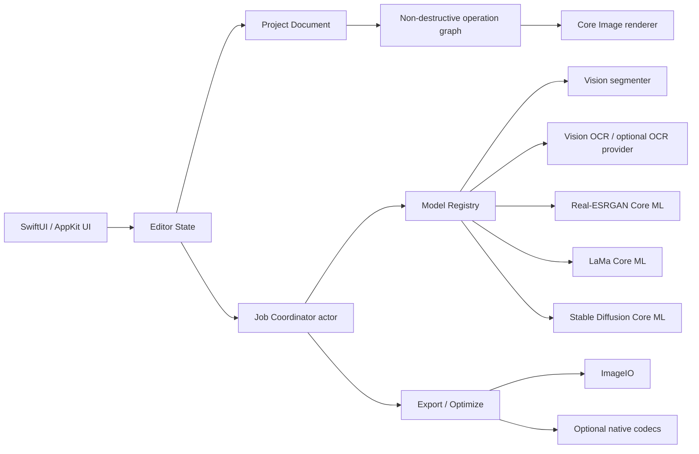
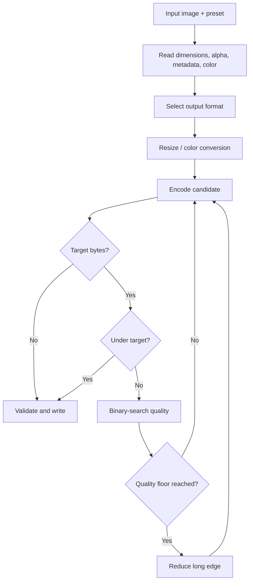

# Architecture

## 1. Architectural goals

- UI ไม่รู้ว่า model มาจาก Core ML, Vision หรือ process ภายนอก
- operation ทุกชนิด preview ได้และ undo ได้
- full-resolution bitmap ไม่ถูก copy โดยไม่จำเป็น
- งาน AI/encode ยกเลิกได้และไม่รันบน main actor
- project เปิดได้แม้ model ที่เคยใช้ถูกลบ โดยแสดงผล render cache เดิม

## 2. System overview



## 3. Suggested package structure

```text
ImageProApp/
├── App/
├── Features/
│   ├── Home/
│   ├── Editor/
│   ├── Optimize/
│   ├── BackgroundRemoval/
│   ├── Upscale/
│   ├── Inpaint/
│   ├── OCR/
│   ├── BatchQueue/
│   └── ModelManager/
├── Core/
│   ├── Imaging/
│   ├── Operations/
│   ├── Project/
│   ├── Jobs/
│   └── Export/
├── AIProviders/
│   ├── VisionForeground/
│   ├── VisionText/
│   ├── RealESRGAN/
│   ├── LaMa/
│   └── StableDiffusion/
├── CodecAdapters/
├── Resources/
└── Tests/
```

เมื่อเริ่มสร้าง Xcode project ให้แยก `ImageProCore` เป็น Swift package เพื่อให้ unit test ได้โดยไม่เปิด app target

## 4. Core data types

```swift
struct PixelSize: Codable, Hashable, Sendable {
    let width: Int
    let height: Int
}

struct ModelManifest: Codable, Hashable, Sendable {
    let id: String
    let version: String
    let sha256: String
    let minimumOS: String
    let expectedInputs: [String]
}

enum EditOperation: Codable, Sendable {
    case crop(CropParameters)
    case resize(ResizeParameters)
    case rotate(RotationParameters)
    case backgroundMask(MaskReference)
    case inpaint(RenderReference, MaskReference)
    case upscale(RenderReference, scale: Int)
    case optimizePreview(OptimizeParameters)
}
```

ห้าม encode raw pixel data ลง JSON; ให้ใช้ content-addressed asset files และเก็บ reference/hash

## 5. Project format

แนะนำ package directory `.imagepro`:

```text
Example.imagepro/
├── project.json
├── assets/
│   ├── original.heic
│   └── masks/
├── renders/
│   ├── previews/
│   └── ai-results/
└── recovery/
```

`project.json` เก็บ:

- schema version
- source hash และ relative path
- ordered operations
- active draft operation
- model id/version/seed ที่สร้าง AI result
- export presets
- timestamps

ใช้ schema migration ตั้งแต่ version 1 แม้ทำใช้เอง เพื่อไม่ให้ project เก่าเปิดไม่ได้หลังแก้ model

## 6. Rendering pipeline

### Interactive preview

1. Decode thumbnail/proxy ที่ใกล้ viewport resolution
2. สร้าง Core Image operation chain
3. Render เฉพาะ visible rectangle
4. Cache ตาม `(sourceHash, operationHash, viewportScale)`

### Final export

1. Decode source ที่ความละเอียดเต็ม
2. Replay deterministic operations
3. Resolve AI operations จาก cached render reference
4. Render เป็น destination color space
5. Encode ไป temporary URL
6. ตรวจ byte count และ metadata
7. Atomic rename ไป output URL

## 7. Mask system

- เก็บ mask logical resolution เท่าภาพต้นฉบับ แต่ paint ผ่าน tiled grayscale texture
- Stroke เป็น vector events จนกด Apply เพื่อ undo ได้ราคาถูก
- Rasterize เฉพาะ dirty tiles
- ใช้ค่า 0–1 ไม่ใช่ binary เพื่อรองรับ soft edge
- Composite convention: white = replace/remove, black = preserve
- ทำ premultiply/unpremultiply ที่ boundary เดียวเพื่อป้องกัน dark fringe

## 8. Job system

`JobCoordinator` เป็น actor และอนุญาต AI heavy job ทีละงานเป็น default เพื่อควบคุม unified memory ส่วน encode batch สามารถทำ concurrent แบบจำกัดจำนวน

Job states:

```text
queued → preparing → running → writing → completed
                         ├────→ cancelled
                         └────→ failed → retrying
```

แต่ละ job ต้องมี:

- stable ID
- input/output security-scoped bookmark ถ้าจำเป็น
- progress 0...1 หรือ indeterminate
- cancellation token
- retry count
- local error summary ที่ไม่บันทึกข้อมูลภาพ

## 9. Model lifecycle

- Registry อ่าน manifest จาก Application Support/Models
- ตรวจ SHA-256 ก่อน register
- `prepare()` แบบ lazy เมื่อเริ่มใช้ tool
- cache model ครั้งละหนึ่ง heavy provider
- memory pressure notification เรียก `unload()`
- diffusion unload เมื่อออกจาก tool หรือ idle ตามเวลาที่ตั้ง
- compiled model อยู่ใน app-managed cache และ rebuild เมื่อ OS/model version เปลี่ยน

## 10. Optimize engine



Format selection rule ของ Auto:

- alpha + flat graphics: PNG lossless
- alpha + photo: WebP
- photo ใน Apple ecosystem: HEIC
- compatibility priority: JPEG
- screenshot/text: PNG หรือ lossless WebP

## 11. Error handling

Error categories:

- unsupportedInput
- corruptImage
- insufficientMemory
- modelMissing/modelInvalid/modelIncompatible
- encodeFailed/writeFailed
- cancelled
- permissionDenied

UI แสดง action ที่ทำต่อได้ เช่น Import Model, Choose Another Format, Reduce Output Size หรือ Retry in Low Memory Mode

## 12. Security and offline guarantee

- ไม่มี networking entitlement ใน MVP
- model import จาก local file เท่านั้น
- logs redact absolute paths
- GPS removal ถูกทดสอบโดยอ่าน metadata กลับหลัง export
- temporary files อยู่ใน app cache และลบเมื่อ launch ครั้งถัดไปถ้างานไม่สมบูรณ์
